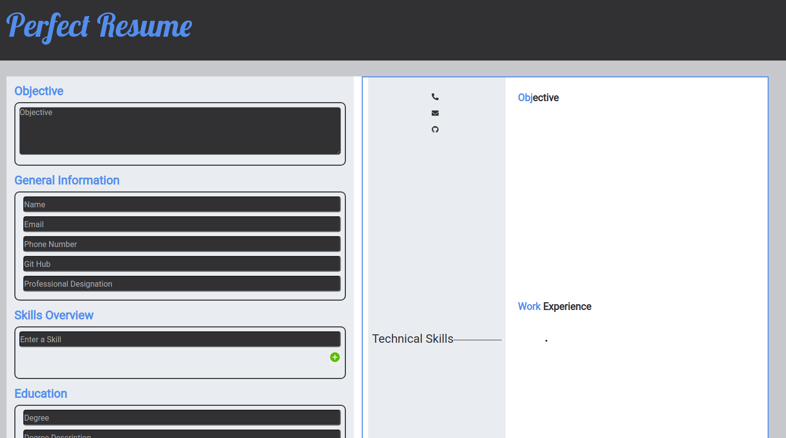
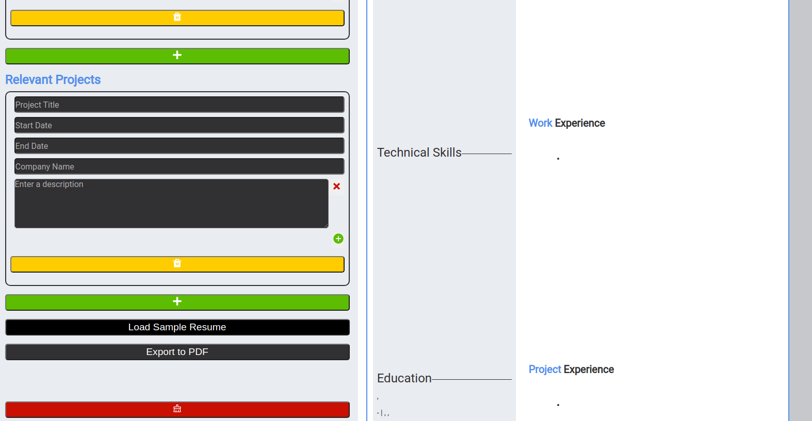

<!-- PROJECT TITLE -->
 

<h3 align="center">Perfect Resume</h3>

  

    Easily Build The Perfect Resume!
     
     
     
    <a href="https://lil-sahil.github.io/react_cv_project/">View Demo</a>
    ·
    <a href="https://github.com/lil-sahil/react_cv_project/issues">Report Bug</a>
    ·
    <a href="https://github.com/lil-sahil/react_cv_project/issues">Request Feature</a>
  

<!-- TABLE OF CONTENTS -->

  
Table of Contents

  <ol>
    <li>
      <a href="#about-the-project">About The Project</a>
      <ul>
        <li><a href="#built-with">Built With</a></li>
      </ul>
    </li>
    <li>
      <a href="#getting-started">Getting Started</a>
      <ul>
        <li><a href="#installation">Installation</a></li>
      </ul>
    </li>
    <li><a href="#usage">Usage</a></li>
    <li><a href="#contact">Contact</a></li>
  </ol>

<!-- ABOUT THE PROJECT -->
## About The Project

A well designed resume, is both eye-catching, and not convoluted with unnecessary information. This is the intent of the Perfect Resume application. It aesthetically places the information entered by the user within the confines of a standard letter sized paper. Along with the design, the resume input fields were designed as such to only empasize the most critical pieces of information that a hopefull job seeker should consider - maximizing their chances of getting hired.

The application has also been optimized to work on mobile devices.

(<a href="#top">back to top</a>)

### Built With

* [React.js](https://reactjs.org/)

(<a href="#top">back to top</a>)

<!-- GETTING STARTED -->
## Getting Started

Visit the below link to use the application - free of charge. Also rest assured, no user information is stored.
     
    <a href="https://lil-sahil.github.io/react_cv_project/">View Demo</a>

(<a href="#top">back to top</a>)

<!-- USAGE EXAMPLES -->
## Usage

- Enter the information in the input fields. The information will be shown in a live preview on the resume template.
     
    

- Scroll down to the bottom of the page where by clicking the appropriate buttons, a sample resume can be filled, along with exporting the finished resume as a pdf for emailing or printing purposes.
     
    

(<a href="#top">back to top</a>)

<!-- CONTACT -->
## Contact

Sahil Nagpal

Project Code: [https://github.com/lil-sahil/react_cv_project]

Project Link: [https://lil-sahil.github.io/react_cv_project/]

(<a href="#top">back to top</a>)

<!-- ACKNOWLEDGMENTS -->
## Acknowledgments

* [GitHub Pages](https://pages.github.com)
* [Google Fonts](https://fonts.google.com/)
* [React Icons](https://react-icons.github.io/react-icons/search)

(<a href="#top">back to top</a>)

